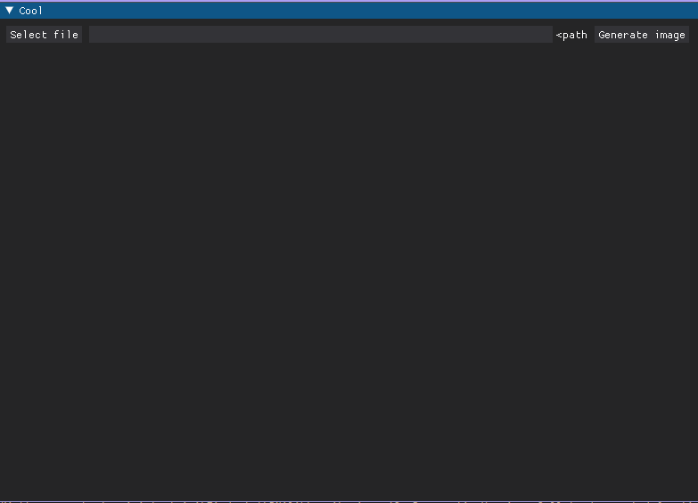

# Art from genomes
I was interested about seeing how genomes looked. So decided to make it into an art project :p. But this will take the provided genome file and load it into memory (bad idea ik) and get its length and make a square image with the resolution of sqrt(genome_lengt) and then loop trough the genome and assign a color to each dna thingy (A, T, G C) and put the color on the square image. It loops over the image array from left to right, top to bottom and buts the color in its corresponding location. Really not accurate, but its cool to see some patterns emerging from the image.

example(vaccinia virus genome):
<br>

(you can see kind of some vertical lines)

- [ ] TODO: Will maybe try adding multithreading, because as we all know, multithreading makes code 100x better
- [ ] TODO: Parse the genome? files better. The current way is shit
- [ ] TODO: Make a better image viewer? Maybe the ability to zoom and pan around (plotting it for now. makes the image a bit blurry but oh well ```-\_(-_-)_/-```)
- [ ] TODO: Validate the genome (never trust the user)
- [ ] TODO: Add custom menu options to save the image
- [ ] TODO: Add a progress bar

# RUNNING:
first, you need the requirements:
```python -m pip install numpy dearpygui icecream Pillow```
then you just run the mmain.py (not main.py bc i had another main.py that i tested stuff on) and it will pop up a gui:

<br>
and then you paste a path to a .txt containing the genome (i dont yet do any "validation" so i trust the user) and press generate. then you will have to wait a bit depending on the size of the genome and eventually it will pop-up an image plot. 
